# Solo Dev Manager - Architecture Diagrams

This document contains visual diagrams for the Solo Dev Manager platform architecture, roadmap, and feature status.

---

## 1. System Architecture Diagram

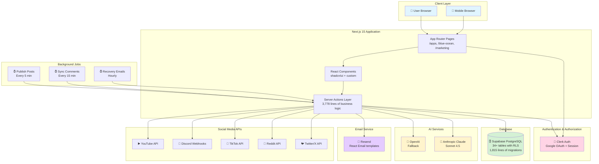

---

## 2. Data Flow - Key Features

### DevLog Creation with AI (Complete)

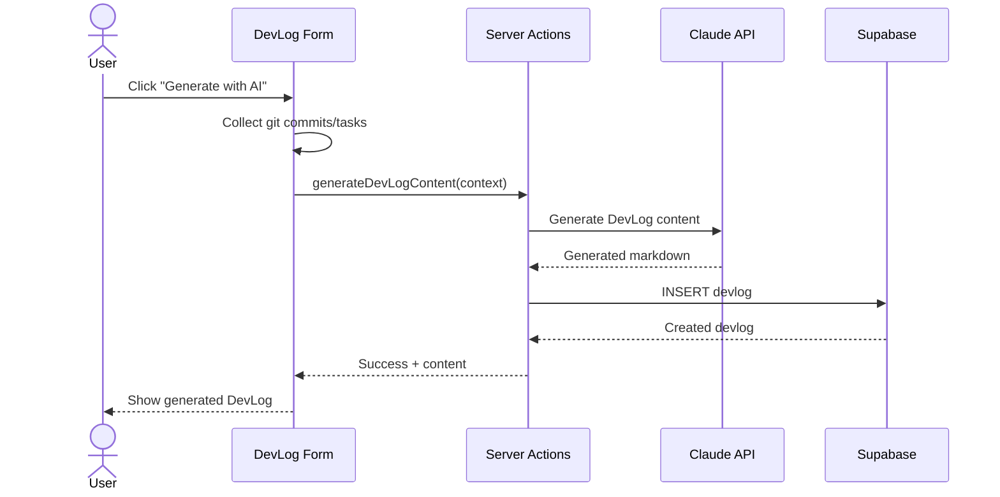

### Waitlist Flow (Complete)

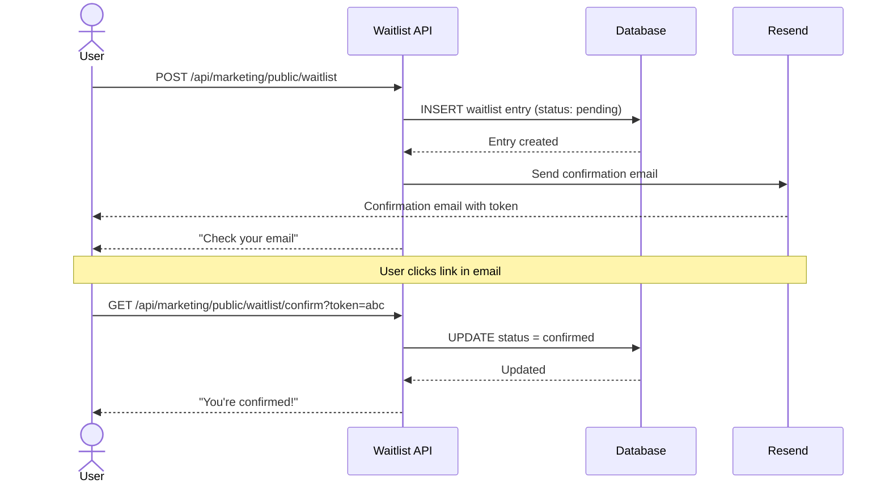

### Social Post Scheduling Flow

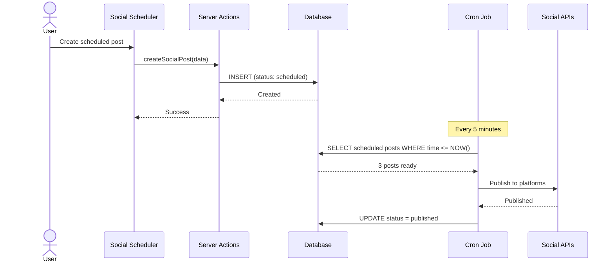

---

## 3. Module Architecture

### Three Core Modules

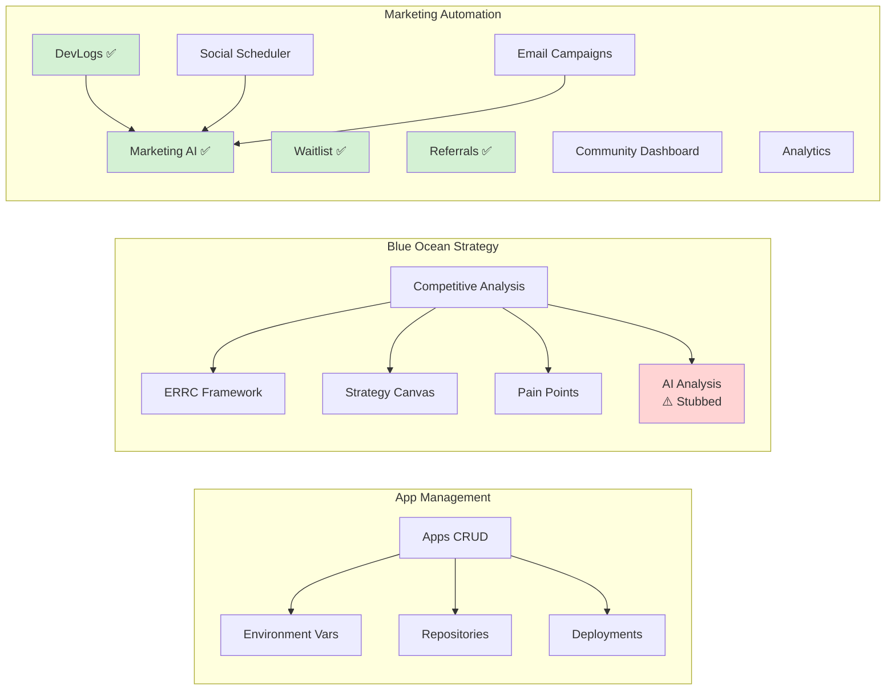

---

## 4. Launch Roadmap Timeline

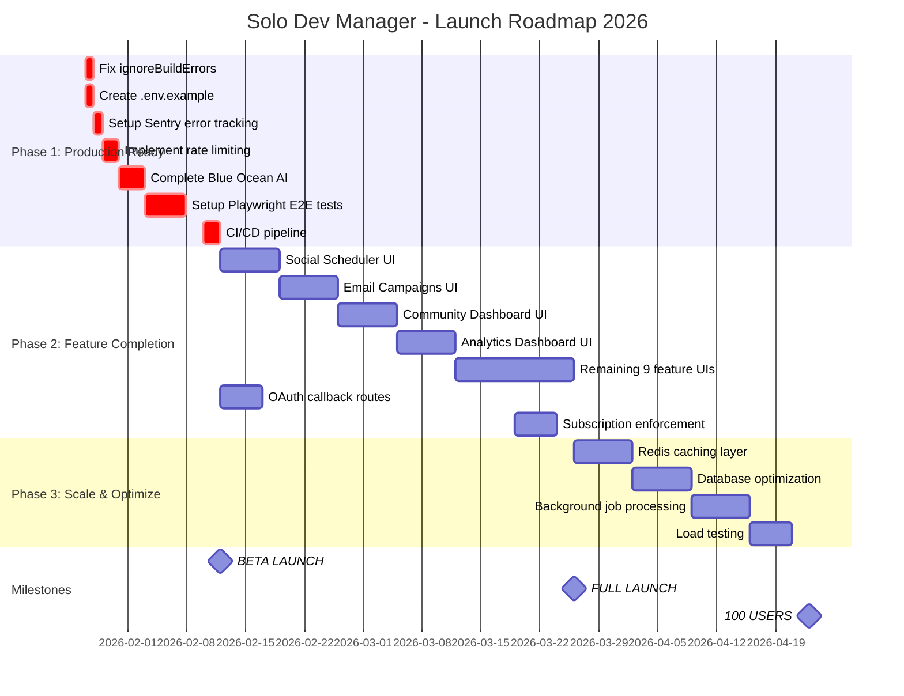

---

## 5. Feature Completion Matrix

### Module Status Overview

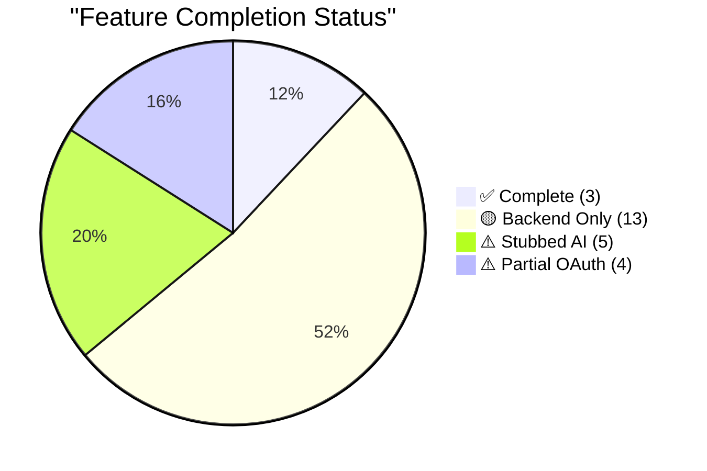

### Detailed Feature Status

| Module | Feature | Backend | Frontend | Testing | Status |
|--------|---------|---------|----------|---------|--------|
| **App Management** |
| | Apps CRUD | ✅ 100% | ✅ 100% | ❌ 0% | 🟢 Working |
| | Environment Vars | ✅ 100% | ✅ 100% | ❌ 0% | 🟢 Working |
| | Repositories | ✅ 100% | ✅ 100% | ❌ 0% | 🟢 Working |
| | Deployments | ✅ 100% | ✅ 100% | ❌ 0% | 🟢 Working |
| **Blue Ocean Strategy** |
| | Analysis CRUD | ✅ 100% | ✅ 100% | ❌ 0% | 🟢 Working |
| | Competitor Tracking | ✅ 100% | ✅ 100% | ❌ 0% | 🟢 Working |
| | ERRC Framework | ✅ 100% | ✅ 100% | ❌ 0% | 🟢 Working |
| | Strategy Canvas | ✅ 100% | ✅ 100% | ❌ 0% | 🟢 Working |
| | AI Analysis | ⚠️ Stubbed | ⚠️ Stubbed | ❌ 0% | 🟡 Mock Data |
| **Marketing - Build in Public** |
| | DevLogs | ✅ 100% | ✅ 100% | ❌ 0% | 🟢 Working |
| | AI DevLog Gen | ✅ 100% | ✅ 100% | ❌ 0% | 🟢 Working |
| **Marketing - Distribution** |
| | Social Scheduler | ✅ 100% | ❌ 0% | ❌ 0% | 🔴 Backend Only |
| | ASO Keywords | ✅ 100% | ❌ 0% | ❌ 0% | 🔴 Backend Only |
| | Email Campaigns | ✅ 100% | ❌ 0% | ❌ 0% | 🔴 Backend Only |
| **Marketing - Engagement** |
| | Community Dashboard | ✅ 100% | ❌ 0% | ❌ 0% | 🔴 Backend Only |
| | Comment Sentiment | ✅ 100% | ❌ 0% | ❌ 0% | 🔴 Backend Only |
| | Vibe Check | ✅ 100% | ❌ 0% | ❌ 0% | 🔴 Backend Only |
| **Marketing - Growth** |
| | Waitlist | ✅ 100% | ✅ 100% | ❌ 0% | 🟢 Working |
| | Referral Programs | ✅ 100% | ✅ 100% | ❌ 0% | 🟢 Working |
| | UGC Gallery | ✅ 100% | ❌ 0% | ❌ 0% | 🔴 Backend Only |
| **Marketing - Monetization** |
| | Pricing/Offers | ✅ 100% | ❌ 0% | ❌ 0% | 🔴 Backend Only |
| | Recovery Emails | ✅ 100% | ❌ 0% | ❌ 0% | 🔴 Backend Only |
| **Marketing - Partnerships** |
| | Creator CRM | ✅ 100% | ❌ 0% | ❌ 0% | 🔴 Backend Only |
| | Press Kit Generator | ✅ 100% | ❌ 0% | ❌ 0% | 🔴 Backend Only |
| | Cross-Promo Network | ✅ 100% | ❌ 0% | ❌ 0% | 🔴 Backend Only |
| **Marketing - Analytics** |
| | North Star Metrics | ✅ 100% | ❌ 0% | ❌ 0% | 🔴 Backend Only |
| | LTV Calculator | ✅ 100% | ❌ 0% | ❌ 0% | 🔴 Backend Only |
| | Ad Campaign Tracker | ✅ 100% | ❌ 0% | ❌ 0% | 🔴 Backend Only |

**Legend:**
- 🟢 **Working:** Feature is production-ready
- 🟡 **Partial:** Feature has issues or stubs (mock data)
- 🔴 **Backend Only:** Backend complete, UI not built
- ⚫ **Not Started:** No implementation

---

## 6. Production Readiness Dashboard

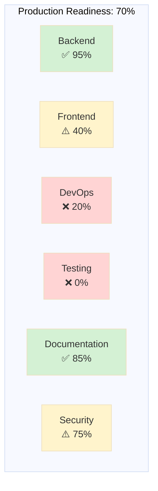

### Category Breakdown

**Backend: 95%** ✅
- ✅ 3,778 lines of server actions
- ✅ 830 lines of validation schemas
- ✅ 1,815 lines of database migrations
- ✅ 34+ tables with RLS
- ⚠️ 5 AI functions stubbed
- ⚠️ 4 external API stubs

**Frontend: 40%** ⚠️
- ✅ Core infrastructure (layouts, navigation)
- ✅ Component library (28 components)
- ✅ 3 complete features (DevLogs, Waitlist, Referrals)
- ❌ 13 marketing features need UI forms
- ❌ Data visualization components
- ⚠️ Mobile responsive (not tested)

**DevOps: 20%** ❌
- ✅ Modern tech stack
- ❌ No testing infrastructure
- ❌ No CI/CD pipeline
- ❌ No production deployment config
- ❌ No monitoring/observability
- ❌ No Docker/containerization

**Documentation: 85%** ✅
- ✅ 4 comprehensive guides (1,364 lines)
- ✅ Setup instructions (QUICKSTART.md)
- ✅ Feature documentation
- ✅ Database schema docs
- ❌ API documentation (no Swagger)
- ❌ Deployment guide
- ❌ Contributing guidelines

**Security: 75%** ⚠️
- ✅ Clerk authentication
- ✅ Supabase RLS on all tables
- ✅ User ownership verification
- ✅ Encrypted token storage
- ✅ Double opt-in email verification
- ❌ No rate limiting
- ❌ No CSRF protection
- ⚠️ Build config issue

**Testing: 0%** ❌
- ❌ Zero test files
- ❌ No unit tests
- ❌ No integration tests
- ❌ No E2E tests
- ❌ No load tests

---

## 7. Critical Path to Beta Launch

```mermaid
graph LR
    Start([Today]) --> P1_1[Fix ignoreBuildErrors]
    P1_1 --> P1_2[Create .env.example]
    P1_2 --> P1_3[Setup Sentry]
    P1_3 --> P1_4[Rate Limiting]
    P1_4 --> P1_5[Complete Blue Ocean AI]
    P1_5 --> P1_6[E2E Tests]
    P1_6 --> Beta([BETA LAUNCH<br/>Week 3])

    style P1_1 fill:#ffd4d4
    style P1_2 fill:#ffd4d4
    style P1_3 fill:#ffd4d4
    style P1_4 fill:#ffd4d4
    style P1_5 fill:#ffd4d4
    style P1_6 fill:#ffd4d4
    style Beta fill:#d4f1d4
```

**Critical Blockers (Must Complete):**
1. ❌ Fix `ignoreBuildErrors: true` → Set to `false`, fix type errors
2. ❌ Create `.env.example` → Document all required env vars
3. ❌ Setup Sentry → Error tracking and monitoring
4. ❌ Rate Limiting → Protect public endpoints from abuse
5. ❌ Complete Blue Ocean AI → Remove mock data (5 functions)
6. ❌ E2E Tests → 15-20 critical path tests

**Timeline:** 2-3 weeks to Beta Launch

---

## 8. Technical Debt Heatmap

```mermaid
quadrantChart
    title Technical Debt Priority Matrix
    x-axis Low Impact --> High Impact
    y-axis Easy Fix --> Hard Fix
    quadrant-1 Plan for Later
    quadrant-2 Do Next
    quadrant-3 Quick Wins
    quadrant-4 Critical (Do Now)

    "ignoreBuildErrors": [0.9, 0.2]
    ".env.example missing": [0.6, 0.1]
    "No rate limiting": [0.9, 0.3]
    "No error tracking": [0.9, 0.2]
    "Blue Ocean AI stubs": [0.8, 0.6]
    "No testing": [0.9, 0.8]
    "13 UI forms missing": [0.8, 0.9]
    "No CI/CD": [0.7, 0.4]
    "External API stubs": [0.5, 0.5]
    "No Docker config": [0.4, 0.3]
```

**Quadrant Breakdown:**
- **Quadrant 4 (Critical - Do Now):** ignoreBuildErrors, rate limiting, error tracking, .env.example
- **Quadrant 2 (Do Next):** Blue Ocean AI stubs, CI/CD, testing infrastructure
- **Quadrant 1 (Plan for Later):** 13 UI forms (high effort)
- **Quadrant 3 (Quick Wins):** Docker config, external API stubs

---

## 9. Database Schema Overview

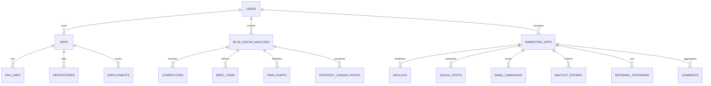

**Statistics:**
- **34+ tables** across 3 modules
- **1,815 lines** of SQL migrations
- **Row Level Security** (RLS) enabled on all tables
- **Proper foreign keys** with cascade deletes
- **Performance indexes** on frequently queried fields

---

## 10. AI Integration Flow

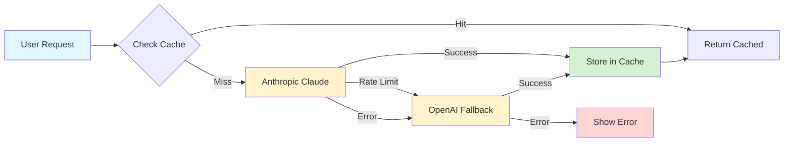

**Current Status:**
- **Marketing AI:** ✅ All 10 functions working with Claude
- **Blue Ocean AI:** ⚠️ 5 functions return mock data (need implementation)
- **Caching:** ❌ Not implemented (recommended: 1hr TTL)
- **Fallback:** ⚠️ OpenAI configured but not tested

---

## 11. OAuth Integration Status

```mermaid
graph TB
    subgraph "OAuth Platforms"
        Twitter[🐦 Twitter/X<br/>⚠️ Partial]
        Reddit[🔴 Reddit<br/>❌ Stub]
        TikTok[📱 TikTok<br/>⚠️ Partial]
        Discord[💬 Discord<br/>⚠️ Config Needed]
        YouTube[▶️ YouTube<br/>⚠️ API Key Needed]
    end

    subgraph "Missing Components"
        Callbacks[OAuth Callback Routes<br/>/api/auth/[platform]/callback]
        Tokens[Token Refresh Logic]
        Error[Error Handling]
    end

    Twitter -.-> Callbacks
    Reddit -.-> Callbacks
    TikTok -.-> Callbacks

    Twitter -.-> Tokens
    TikTok -.-> Tokens

    style Twitter fill:#fff4cc
    style Reddit fill:#ffd4d4
    style TikTok fill:#fff4cc
    style Discord fill:#fff4cc
    style YouTube fill:#fff4cc
    style Callbacks fill:#ffd4d4
```

**Required Work:**
- Twitter: OAuth callback route + token refresh
- Reddit: Full snoowrap integration + OAuth callback
- TikTok: OAuth callback route + video upload
- Discord: Webhook configuration
- YouTube: API key setup + comment fetching

**Estimated Effort:** 2-3 days for all platforms

---

## Summary

These diagrams illustrate:

1. **System Architecture** - How all components interact
2. **Data Flows** - Key feature workflows
3. **Module Structure** - Three core modules and their relationships
4. **Launch Timeline** - Path to beta and full launch
5. **Feature Status** - Completion matrix for all features
6. **Readiness Dashboard** - Production readiness by category
7. **Critical Path** - Blockers preventing launch
8. **Technical Debt** - Priority matrix for fixes
9. **Database Schema** - Table relationships
10. **AI Integration** - Claude + OpenAI fallback flow
11. **OAuth Status** - Platform integration status

**Use these diagrams to:**
- Communicate architecture to stakeholders
- Track progress toward launch
- Prioritize development work
- Understand system complexity
- Plan resource allocation
